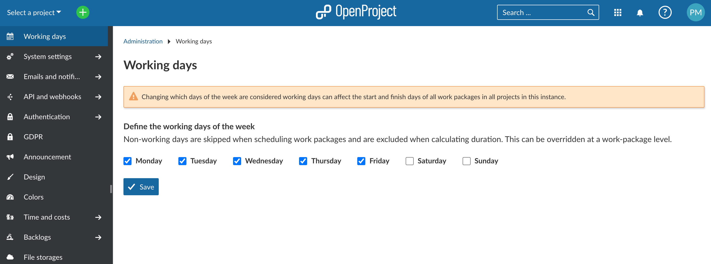
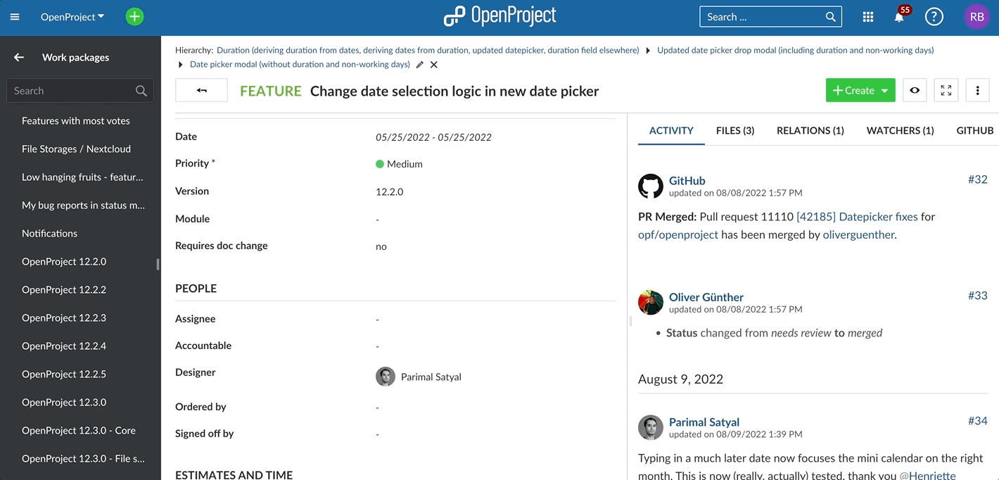
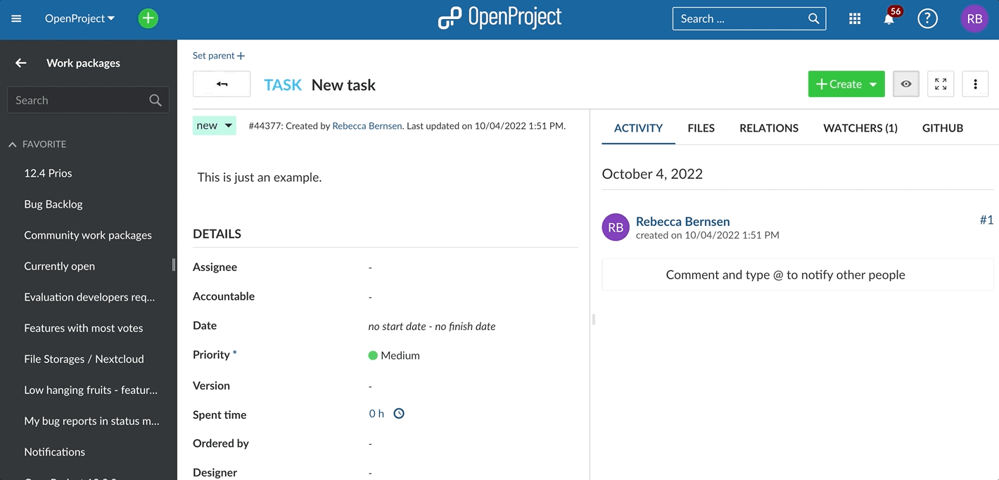
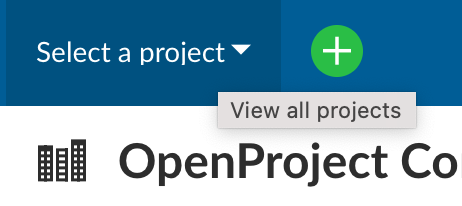

# OpenProject 12.3.0

Release date: 2022-10-10

We have now released [OpenProject 12.3.0](https://community.openproject.com/versions/1514).

This release **improves the scheduling of work packages significantly** and will consequently save you a lot of time and make your scheduling more accurate.

With OpenProject 12.3, administrators can define the [global work week](../../../system-admin-guide/calendars-and-dates/#working-days). That means which days of the week are working days and which are non-working days. The default setting for the work week is Monday-Friday. But you can set it according to your needs and define work week and weekends as needed.

OpenProject 12.3 also adds [duration](../../../user-guide/work-packages/set-change-dates/#duration) to work packages. Thereby, the duration is bound to the start and the finish date.

With the introduction of the work week and duration, consequently also the [date picker got improved](../../../user-guide/work-packages/set-change-dates/#working-days). You will now see the duration as well as a switch to consider "Working days only" for your planning. 

Addtionally, this release launches **meaningful tool tips to the most essential actions**, and **when copying a project, all file links attached to work packages will be copied as well**.

As always, this release also contains many more improvements and bug fixes. We recommend updating to the newest version as soon as possible.

## Introduction of the global work week

OpenProject 12.3 gives the administrator the possibility to specify working and non-working days on an overall instance-level and consequently define a global work week. 

This helps you to create more accurate project schedules and avoid having start or finish date of a work packages on a weekend. Non-working days are displayed grey in the calendar and work packages cannot be scheduled to start or finish on those days. The default value for non-working days is set to Saturday and Sunday, but you set them as needed.

You can find out [how to set working and non-working days](../../../system-admin-guide/calendars-and-dates/#working-days) and [how to schedule your work packages within and without working and non-working days](../../../user-guide/work-packages/set-change-dates/#working-days) in our documentation.

## Duration of work packages

OpenProject 12.3 introduces the duration of work packages. Schedule your work packages faster by using the new duration field.

The duration is always expressed in days and is the number of days between start and finish dates (inclusive). It is directly related to the start and finish dates, but does not require both of them. You can define a start date for a work package, enter the duration in working days and the finish date will automatically be set. Also, you can enter duration and finish date and the start date will be set. In all cases, the duration is consistent with the start and the finish date. Updating dates will update the duration, and updating duration will update your finish date.

Find out more on [how to make best use of the duration for your scheduling](../../../user-guide/work-packages/set-change-dates/#duration) in our documentation.

## Upgrade of the date picker

With the addition of duration and introduction of the global work week, the date picker got updated to reflect these changes. You will now find a duration field and a working days only switch.

The duration field is obviously there to indicate the duration of a work package and to assist with setting start or finish date.

With the working days only switch you can decide to either stick to the set work week or to include weekends. 

By default the **Working days only** switch is activated and the work week, as defined in the administration settings, is used to define the duration. Consequently, non-working days are not included in the calculation of the duration. These non-working days show in grey in the calendar and are not clickable.

By moving the switch and deactivate the “Working days only”, non-working days will be included in the calculation of the duration. You can now also select non-working days as start or finish dates of work packages. Hence, all days appear the same in the calendar and all are clickable.

The functionality of the "Working days only" switch is well [documented](../../../user-guide/work-packages/set-change-dates/#working-days).

### Please note the impact on the scheduling of all work packages 

These changes to scheduling will not impact work packages created before the release of OpenProject 12.3 or before the upgrade to OpenProject 12.3. For the work packages created before OpenProject 12.3, the setting will have automatically turned-off the switch for “Working days only”. This is important to not change any existing dates for work packages. However, for new work packages, the switch will be set by default to “Working days only”.

## Tool tips for most essential actions

The new and additional tool tips in the OpenProject application will make the navigation easier for users that are not yet very familiar with OpenProject. The tool tips make clear what happens when the user clicks on a certain button.  

##  List of all bug fixes and changes

- Epic: Define weekly work schedule (weekends) [#18416](https://community.openproject.com/wp/18416)
- Epic: Duration (deriving duration from dates, deriving dates from duration, updated datepicker, duration field elsewhere) [#31992](https://community.openproject.com/wp/31992)
- Fixed: Quick-add menu not showing on smaller screens [#37539](https://community.openproject.com/wp/37539)
- Fixed: Attachments are not going to be copied, when using "Copy to other project" function [#43005](https://community.openproject.com/wp/43005)
- Fixed: Filters are not working after adding a custom field with default value [#43085](https://community.openproject.com/wp/43085)
- Fixed: BIM edition unavailable on Ubuntu 22.04 packaged installation [#43531](https://community.openproject.com/wp/43531)
- Fixed: Can't delete WPs from board view [#43761](https://community.openproject.com/wp/43761)
- Fixed: Insufficient contrast ratio between activity font color and background [#43874](https://community.openproject.com/wp/43874)
- Fixed: SystemStackError (stack level too deep) when trying to assign new parent or children to a work package [#43894](https://community.openproject.com/wp/43894)
- Fixed: Strange arrangement of files when creating a new work package [#44052](https://community.openproject.com/wp/44052)
- Fixed: CKEditor not wrapping the words at the end of the sentence (edit and view mode) [#44125](https://community.openproject.com/wp/44125)
- Fixed: File storage OAuth setting fields should not get translated [#44146](https://community.openproject.com/wp/44146)
- Fixed: Log out user when delete work package from board [#44161](https://community.openproject.com/wp/44161)
- Fixed: Work packages can have start_dates > due_dates [#44243](https://community.openproject.com/wp/44243)
- Fixed: Backup failed: pg_dump: password authentication failed for user "openproject" [#44251](https://community.openproject.com/wp/44251)

- Fixed: "Group by" options in Cost report are broken [#44265](https://community.openproject.com/wp/44265)
- Fixed: Files list: inconsistencies in spacing and colours  [#44266](https://community.openproject.com/wp/44266)
- Fixed: API call for custom_options does not work custom fieleds in time_entries [#44281](https://community.openproject.com/wp/44281)
- Fixed: Email Reminder:  Daily reminders can only be configured to be delivered at a full hour. [#44300](https://community.openproject.com/wp/44300)
- Changed: Cleanup placeholders of editable attributes [#40133](https://community.openproject.com/wp/40133)
- Changed: Updated date picker drop modal (including duration and non-working days) [#41341](https://community.openproject.com/wp/41341)
- Changed: Copying a project shall also copy file links attached to all work packages [#41530](https://community.openproject.com/wp/41530)
- Changed: Administration page for changing the global work schedule - Weekends only [#42316](https://community.openproject.com/wp/42316)
- Changed: Add meaningful tooltips to the most essential actions [#43299](https://community.openproject.com/wp/43299)
- Changed: Hide time stamp and avatar when there are hover actions  [#43308](https://community.openproject.com/wp/43308)
- Changed: Use a disabled mouse style and tooltip for inactive files [#43399](https://community.openproject.com/wp/43399)
- Changed: Update work package table view for duration [#43636](https://community.openproject.com/wp/43636)
- Changed: Update gantt chart for duration and non-working days [#43637](https://community.openproject.com/wp/43637)
- Changed: Update team planner and calendar for duration and non-working days [#43638](https://community.openproject.com/wp/43638)
- Changed: Delete/Unlink modal [#43663](https://community.openproject.com/wp/43663)
- Changed: Add information toast to the Nextcloud Setup Documentation [#43851](https://community.openproject.com/wp/43851)
- Changed: Disregard distance (not lag) between related work packages when scheduling FS-related work packages [#44053](https://community.openproject.com/wp/44053)
- Changed: Add packaged installation support for SLES 15 [#44117](https://community.openproject.com/wp/44117)
- Changed: Replace toggles for scheduling mode and working days with on/off-switches [#44147](https://community.openproject.com/wp/44147)
- Changed: New release teaser block for 12.3 [#44212](https://community.openproject.com/wp/44212)
- Changed: Add the Switch component and Switch Field pattern to the design system [#44213](https://community.openproject.com/wp/44213)

### Contributions

A big thanks to community members for reporting bugs, helping us identify issues and providing fixes.

- A very special thanks to the City of Cologne for sponsoring the feature development of work week and work package duration.
- Special thanks for reporting and finding bugs go to Stuart Malt, Herbert Cruz, Matthias Weber, Alexander Seitz, Daniel Hug, Christian Noack, Christina Vechkanova, Noel Lublovary, Hans-Gerd Sandhagen, Sky Racer.
- A big thank you to every other dedicated user who has [reported bugs](../../../development/report-a-bug) and supported the community by asking and answering questions in the [forum](https://community.openproject.org/projects/openproject/boards).
- A big thank you to all the dedicated users who provided translations on [CrowdIn](https://crowdin.com/projects/opf).
