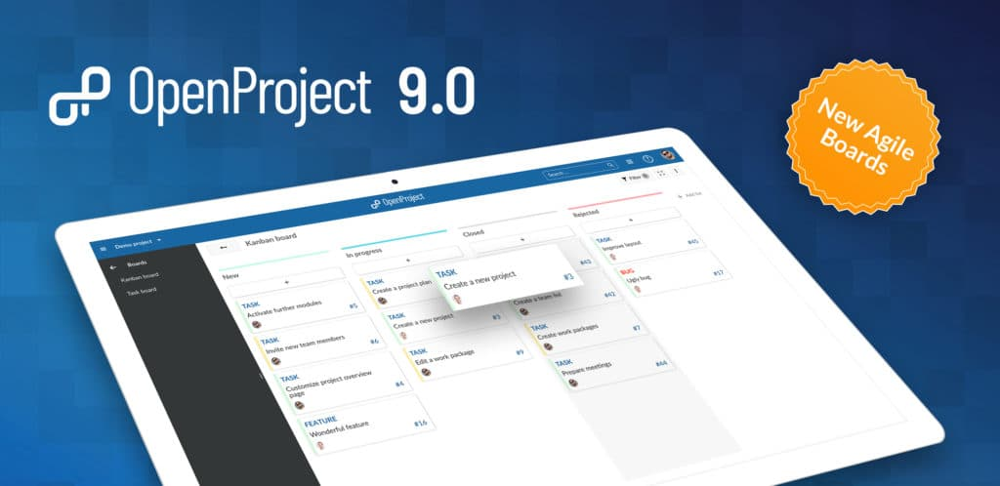
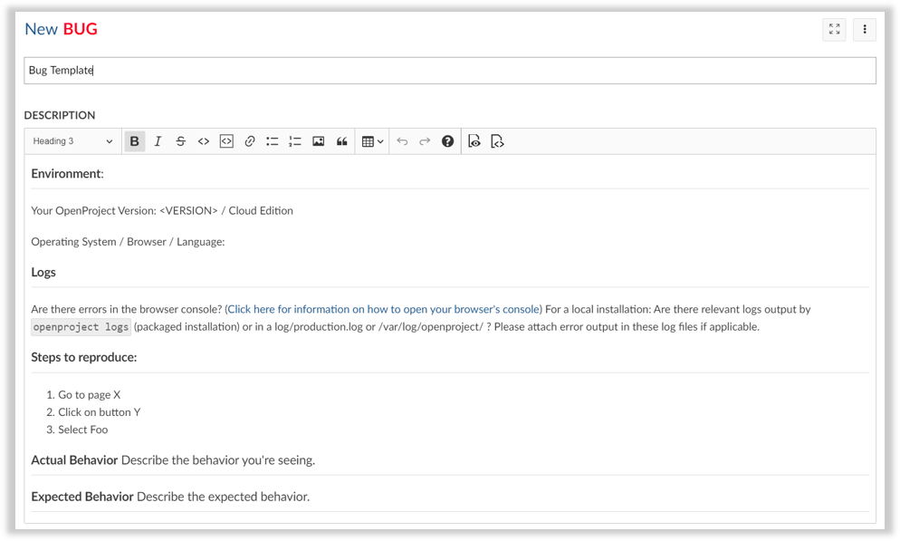
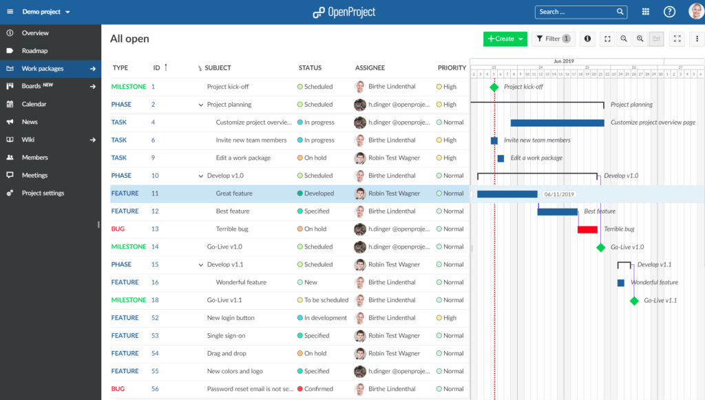

# OpenProject 9.0

OpenProject 9.0 introduces a board view to support agile project management with Kanban. In addition, you can define work package templates to rapidly create new work packages with a pre-defined structure. Each user can now add their own custom work package views to their my page.

Read below to get a detailed overview of what is new in OpenProject 9.

## Board view (Enterprise add-on)

The board view is a new module for OpenProject and allows Scrum and Kanban-style agile project management. You can display display a board view with the different statuses shown as columns (similarly to a Kanban board) and quickly update the status. Alternatively, you can define a basic board with custom names or display versions as columns (e.g. to plan your roadmap).

Since boards display work packages - just like the work package tables - you can easily combine traditional and agile project management. Simply schedule your tasks in the Gantt chart and work on them from the boards view.

To use boards you need to use either the Enterprise cloud or the Enterprise on-premises edition. If you currently use the Community edition and would like to give boards a try, simply [request an Enterprise edition trial license]().

[Learn more about Boards for Scrum and Agile Project Management.]()

## Work package templates

You can define templates for work package types. Templates are automatically displayed in the work package description when you create a new type (e.g. a bug) for which a template is defined. This makes it easier to quickly create new work packages with similar information while reducing errors.

Templates can be configured in the work package type configuration.

## Work package widget on My Page

On the My Page, each user can add work package widgets and customize which work packages to display.

You can filter and group by work package attributes and also display Gantt charts in the widgets.

## Updated work package table

Assignees are now directly displayed as avatars in the work package page. Additionally, the work package type selection has been updated.

## Improved usability

OpenProject is even more user-friendly: You can add attachments (e.g. images) directly to meetings (agenda / minutes).

Creating work packages on the global work package table is now easier as well: When you select a type, only the projects in which the types are activated can be selected in the project menu.

Filters and work package attributes are improved and support auto-completion.

For an overview of all new improvements, take a look at the [feature list](https://community.openproject.com/projects/openproject/work_packages?query_props={"c"%3A["id"%2C"subject"%2C"type"%2C"status"%2C"assignee"%2C"version"]%2C"hi"%3Atrue%2C"g"%3A""%2C"t"%3A"id%3Aasc"%2C"f"%3A[{"n"%3A"status"%2C"o"%3A"!"%2C"v"%3A["6"]}%2C{"n"%3A"version"%2C"o"%3A"%3D"%2C"v"%3A["853"]}%2C{"n"%3A"subprojectId"%2C"o"%3A"*"%2C"v"%3A[]}%2C{"n"%3A"type"%2C"o"%3A"%3D"%2C"v"%3A["6"%2C"8"]}]%2C"pa"%3A1%2C"pp"%3A100}).

## Substantial number of bug fixes

OpenProject 9.0 contains a large number of bugs fixes.

For an extensive overview of bug fixes please refer to the [following list](https://community.openproject.com/projects/openproject/work_packages?query_props={"c"%3A["id"%2C"subject"%2C"type"%2C"status"%2C"assignee"]%2C"hi"%3Afalse%2C"g"%3A""%2C"t"%3A"id%3Adesc"%2C"f"%3A[{"n"%3A"version"%2C"o"%3A"%3D"%2C"v"%3A["853"]}%2C{"n"%3A"type"%2C"o"%3A"%3D"%2C"v"%3A["1"]}%2C{"n"%3A"subprojectId"%2C"o"%3A"*"%2C"v"%3A[]}]%2C"pa"%3A1%2C"pp"%3A20}).

## Upgrading your installation to OpenProject 9.0.

If you're using the OpenProject Enterprise cloud edition, you are already running on the latest version of OpenProject 9.0. For your local installations, there are some minor changes you need to do in order to perform the upgrade.

[Please visit our upgrade guides for more information](../../../installation-and-operations/operation/upgrading).
