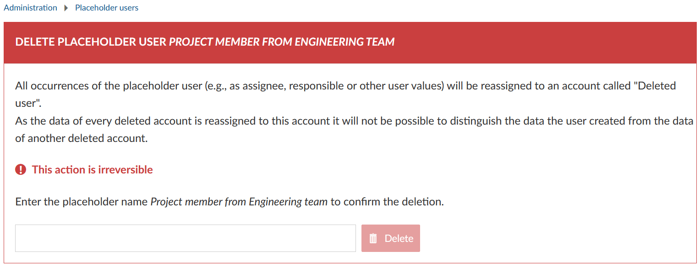
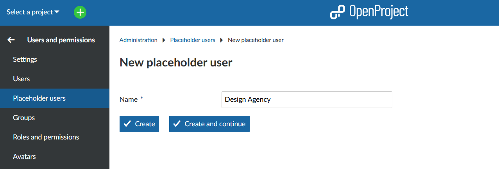
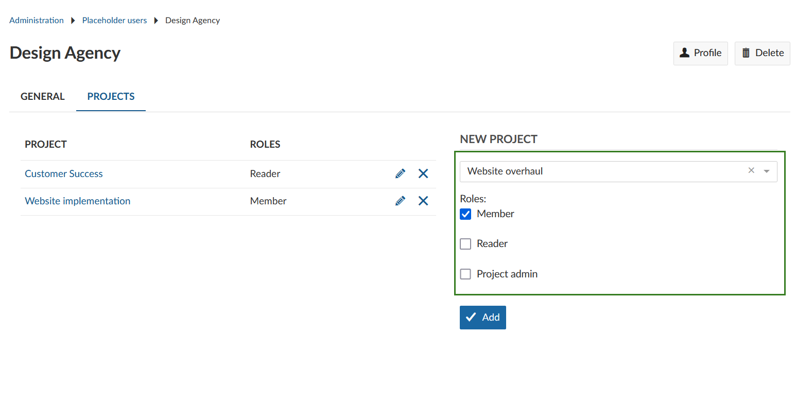
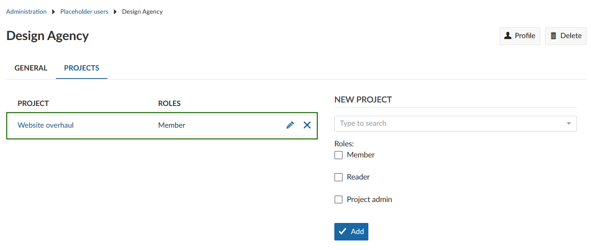
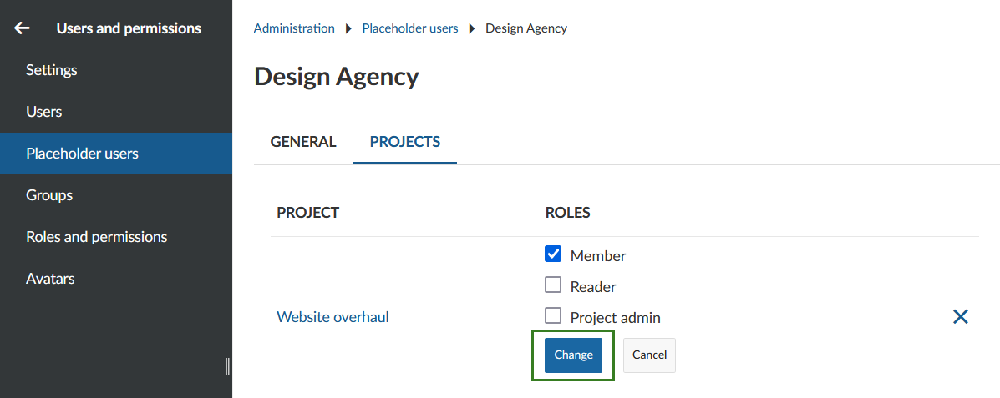

---
sidebar_navigation:
  title: Placeholder users
  priority: 985
description: Manage placeholder users in in OpenProject.
keywords: placeholder user, example, wildcard, place holder
---

# Placeholder users (Enterprise add-on)

In [OpenProject Enterprise on-premises](https://www.openproject.org/enterprise-edition/) and [OpenProject Enterprise cloud](https://www.openproject.org/hosting/) you can add placeholder users to your instance. They can be created without an email address and do not need license seats.

Placeholder users can be used to plan a project with or for users who haven't been added to that project yet. This way you can set up projects before staffing them.
Another use case would be to include customers, vendors or partners in your planning without them knowing it.

Placeholder users can be managed by system admins and by users with the [role](../roles-permissions/#global-role) "Create, edit and delete placeholder users".

| Topic                                                                 | Content                                              |
|-----------------------------------------------------------------------|------------------------------------------------------|
| [Placeholder user list](#placeholder-user-list)                       | Manage placeholder users in OpenProject.             |
| [Create placeholder users](#create-placeholder-users)                 | Add new placeholder users.                           |
| [Manage placeholder user settings](#manage-placeholder-user-settings) | Change names and add placeholders users to projects. |

## Placeholder user list

To manage placeholder users navigate to **Administration -> Users and permissions -> Placeholder users**. The placeholder user list gives you an overview of all placeholder users with their names and creation dates. From here you can also [add](#create-placeholder-users) placeholder users, [edit](#manage-placeholder-user-settings) them and [delete](#delete-placeholder-users) them.

The column headers can be clicked to toggle sort direction. Arrows indicate sort order, up for ascending (a-z/0-9) and down for descending (z-a/9-0).

### Filter placeholder users

The placeholder user list can be filtered by name. 

At the top of the user list is a filter box. Enter a name, then click the blue **Apply** button to filter the list. Click the **Clear** button to reset the filter field and refresh the list.
You can enter any parts of a placeholder user name; this can also contain a **%** wild card for zero or more characters. 

### Delete placeholder users

To delete a placeholder user open the [placeholder user list](#placeholder-user-list). Click on the trash can symbol on the right to choose the placeholder user that you want to remove.

You will then be asked to type in the placeholder user name to confirm the deletion.

> **Note**: Deleting a placeholder user account is an irreversible action and cannot be revoked. The previous activities from this user will still be displayed in the system but reassigned to **Deleted user**.

## Create placeholder users
To add a new placeholder, user click on **+ Placeholder user** in the upper right corner of the [placeholder user list](#placeholder-user-list).
Enter a name and click on **Create** to save or on **Create and continue** to save and create another placeholder user.

It is not possible to create two placeholder users with the exact same name.

## Manage placeholder user settings

You can change a placeholder user's name and add it to a project if you click on its name in the [placeholder user list](#placeholder-user-list). 

On the **General** tab you can change the placeholder user's name.

In order to be assigned to work packages and participate in a project, a placeholder user has to be a member of a project and needs to be added with a certain role to this project.
On the **Projects** tab, select a project from the drop-down list, choose the [**role(s)**](../roles-permissions) for the placeholder user in this project and click the blue **Add** button.

To change a placeholder user's role in a project or to remove it from the project use the **edit button (pen)** or **delete button (X)**, respectively.

If you edit the placeholder user's role(s) don't forget to use the **Change** button to save your changes.

**Note**: You can also use a project's [member list](../../../user-guide/members) to manage a placeholder user's participation in a project.

### Additional settings

Placeholder users cannot be added to groups and cannot be assigned global roles. The avatar currently looks like that of users without a profile picture.
In the future, additional changes and features for placeholder users will be implemented.

## Placeholder user profile

Similar to users, placeholder users have a profile page which shows their name and project memberships. 

The projects are only visible for users who are allowed to see the project (e.g. user has permission to see this placeholder user in a common project or has a sufficient global role (e.g. system administrator)). 

The profile page can be accessed via the [placeholder user settings](#manage-placeholder-user-settings) and via the overview page of projects the placeholder user is a member of.
